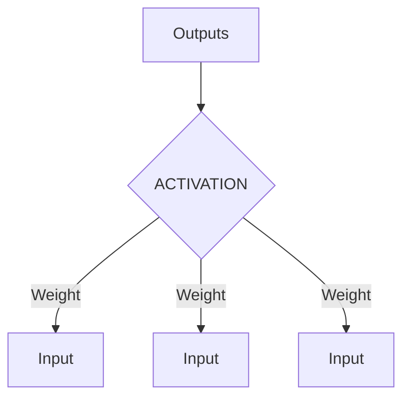

# Neurons

The building blocks for neural networks are artificial neurons.

These are simple computational units that have weighted input signals and produce an output signal using an activation function.

