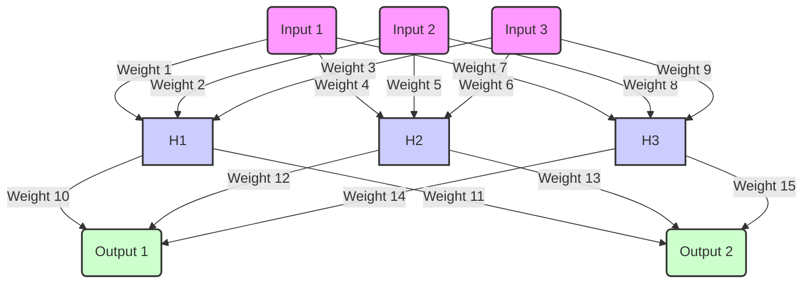

# Multi-Layer Perceptron Neural Networks

## Legend

| **Element**        | **Description**                                                                 |
|--------------------|---------------------------------------------------------------------------------|
| **Input Neurons**  | Neurons in the input layer representing features or data points.                |
| **Hidden Neurons** | Neurons in the hidden layer performing intermediate processing and feature extraction. |
| **Output Neurons** | Neurons in the output layer providing the final predictions or classifications.  |
| **Weights**        | Parameters that adjust the strength of the connections between neurons.         |
| **Activation Functions** | Functions applied to the weighted sum of inputs and bias to introduce non-linearity. |

#### Building Blocks of Neural Networks

1. **Neurons**:
   - **Description**: The fundamental units of a neural network, inspired by biological neurons. Each neuron receives input, processes it, and passes it on to the next layer.
   - **Components**:
     - **Input**: Signals from previous neurons or raw data.
     - **Weights**: Parameters that adjust the strength of the input signals.
     - **Bias**: An additional parameter that shifts the activation function.
     - **Activation Function**: A function applied to the weighted sum of inputs and bias to introduce non-linearity.

2. **Weights**:
   - **Description**: Parameters that are learned during training. They represent the strength of the connections between neurons. Each connection between neurons has an associated weight that adjusts as the network learns.

3. **Activation Functions**:
   - **Purpose**: Introduce non-linearity into the model, allowing the network to learn complex patterns.
   - **Common Functions**:
     - **Sigmoid**: \\( \sigma(x) = \frac{1}{1 + e^{-x}} \\) - Maps input to a value between 0 and 1.
     - **ReLU (Rectified Linear Unit)**: \\( \text{ReLU}(x) = \max(0, x) \\) - Outputs the input directly if positive; otherwise, outputs zero.
     - **Tanh**: \\( \text{tanh}(x) = \frac{e^x - e^{-x}}{e^x + e^{-x}} \\) - Maps input to a value between -1 and 1.
     - **Gelu (Gaussian Error Linear Unit)**: \\( \text{GELU}(x) = x \cdot \sigma(\text{tanh}(x)) \\) - Maps input to a value between -1 and 1.

#### Layers in Neural Networks

1. **Input Layer**:
   - **Description**: The first layer that receives the raw input data. Each neuron in this layer represents one feature of the input.

2. **Hidden Layers**:
   - **Description**: Intermediate layers between the input and output layers. These layers perform computations and feature extraction. Each hidden layer consists of multiple neurons.
   - **Types**:
     - **Fully Connected Layer**: Every neuron is connected to all neurons in the previous layer.
     - **Convolutional Layer**: Used in convolutional neural networks (CNNs) to process spatial hierarchies in data.

3. **Output Layer**:
   - **Description**: The final layer that produces the output of the network. The number of neurons in this layer corresponds to the number of classes or values to be predicted.

#### Impact of Noise on Prediction Quality

1. **Definition of Noise**:
   - **Description**: Random or irrelevant information in the data that can distort the learning process of the neural network. Noise can come from various sources, such as measurement errors, data entry mistakes, or irrelevant features.

2. **Effects on Prediction Quality**:
   - **Overfitting**: Noise can cause the model to learn irrelevant patterns specific to the training data, leading to poor generalization to new data.
   - **Reduced Accuracy**: The presence of noise can lower the accuracy of the predictions, as the model may misinterpret noisy data as meaningful.
   - **Increased Variance**: Models trained on noisy data may exhibit high variance, meaning their performance can vary significantly across different datasets.

3. **Mitigation Strategies**:
   - **Data Preprocessing**: Clean and preprocess data to remove or reduce noise before training.
   - **Regularization**: Techniques like L1/L2 regularization can help prevent overfitting by adding a penalty for large weights.
   - **Cross-Validation**: Use cross-validation to assess the model's performance on different subsets of the data, helping to ensure robustness.
   - **Noise Robust Models**: Employ algorithms and architectures that are less sensitive to noise, such as ensemble methods or robust loss functions.

### Conclusion

Multi-Layer Perceptron (MLP) neural networks are powerful tools for learning complex patterns in data. Understanding the building blocks such as neurons, weights, and activation functions, and how they are organized into layers, is crucial for designing and training effective neural networks. Additionally, addressing the impact of noise on prediction quality is essential for developing robust models that perform well on real-world data.
