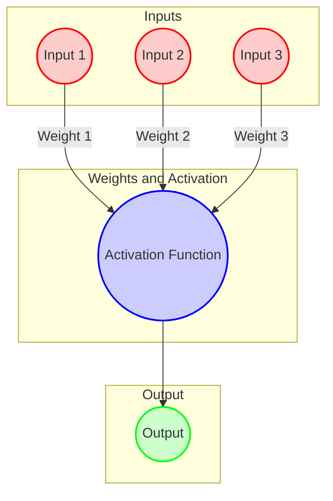

# Neuron

The building blocks for neural networks are artificial neurons.

These are simple computational units that have weighted input signals and produce an output signal using an activation function.

## Legend

| **Element**              | **Description**                                                                 |
|--------------------------|---------------------------------------------------------------------------------|
| **Input**                | The raw data or signals fed into the neuron.                                    |
| **Weights**              | Parameters that adjust the strength of the input signals.                       |
| **Activation Function**  | A function applied to the weighted sum of inputs and bias to produce the output. |
| **Output**               | The result produced by the neuron after applying the activation function.       |

### Color Coding

| **Layer**                | **Color**       |
|--------------------------|-----------------|
| **Input**                |  Light Pink |
| **Weights and Activation Function** |  Light Blue |
| **Output**               |  Light Green |

### Structure of a Neuron

An artificial neuron receives inputs, each multiplied by a weight. The weighted inputs are then summed and passed through an activation function to produce an output.

### Components of a Neuron

1. **Inputs**: The signals or features fed into the neuron. Each input is associated with a weight.

2. **Weights**: Parameters that scale the input signals. During training, weights are adjusted to minimize the error in the model's predictions.

3. **Activation Function**: A function applied to the weighted sum of the inputs to introduce non-linearity. Common activation functions include:
   - **Sigmoid**: \( \sigma(x) = \frac{1}{1 + e^{-x}} \)
   - **Tanh**: \( \tanh(x) = \frac{e^x - e^{-x}}{e^x + e^{-x}} \)
   - **ReLU (Rectified Linear Unit)**: \( \text{ReLU}(x) = \max(0, x) \)
   - **Leaky ReLU**: \( \text{Leaky ReLU}(x) = \max(0.01x, x) \)

4. **Output**: The result of applying the activation function to the weighted sum of the inputs. This output is then passed to the next layer in the network.

### Working of a Neuron

1. **Compute Weighted Sum**: Calculate the sum of all input signals multiplied by their respective weights.

2. **Apply Activation Function**: Pass the weighted sum through the activation function to produce the neuron's output.

Neurons are combined in layers to build complex neural networks capable of learning and making predictions based on data.
