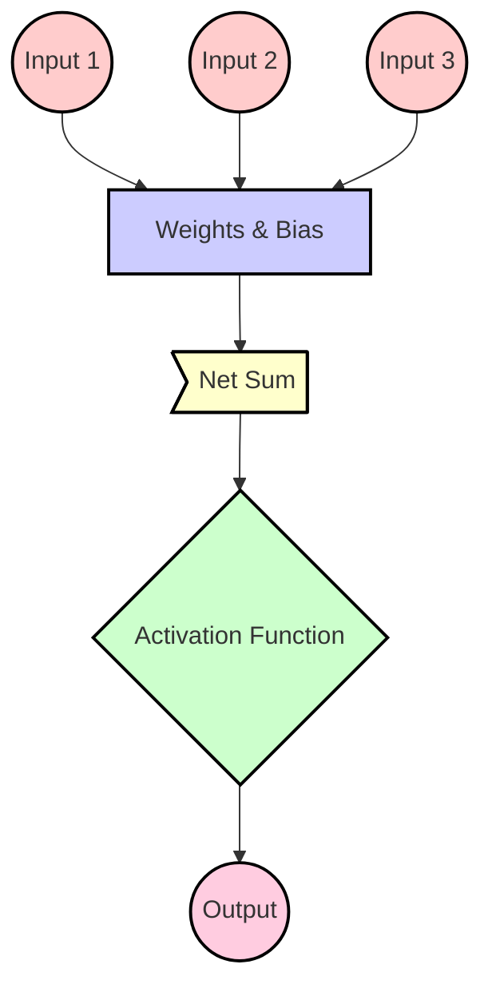

# Perceptron

A **perceptron** (or *McCulloch–Pitts neuron*) is a fundamental building block in neural networks and serves as a precursor to more complex neural network architectures.

A perceptron is a **single-layer neural network**. More complex neural networks with multiple layers are referred to as **multi-layer perceptrons** or simply **neural networks**.

## Legend

| **Element**              | **Description**                                                                 |
|--------------------------|---------------------------------------------------------------------------------|
| **Input**                | The raw data or signals fed into the perceptron.                                |
| **Weights & Bias**       | Parameters that adjust the strength of the input signals and include bias.      |
| **Net Sum**              | The weighted sum of inputs plus bias before applying the activation function.   |
| **Activation Function**  | A function applied to the net sum to produce the output.                        |
| **Output**               | The result produced by the perceptron after applying the activation function.   |

### Color Coding

| **Component**            | **Color**       |
|--------------------------|-----------------|
| **Input**                |  |
| **Weights & Bias**       |  |
| **Net Sum**              |  |
| **Activation Function**  |  |
| **Output**               |  |

### Components of a Perceptron

The perceptron consists of four main parts:

1. **Input Values**:
   - Also known as the **input layer**, these are the raw data or features fed into the perceptron. Each input value represents a feature of the data.

2. **Weights and Bias**:
   - **Weights**: Parameters associated with each input value. They determine the importance of each input feature. During training, the weights are adjusted to minimize the error in predictions.
   - **Bias**: An additional parameter that allows the model to fit the data better by shifting the activation function. It helps in adjusting the output independently of the input values.

3. **Net Sum**:
   - The perceptron calculates a **net sum** by taking the weighted sum of the inputs and adding the bias. Mathematically, this can be represented as:
     \[
     \text{Net Sum} = \sum (w_i \cdot x_i) + b
     \]
     where \( w_i \) represents the weights, \( x_i \) represents the input values, and \( b \) represents the bias.

4. **Activation Function**:
   - The net sum is passed through an **activation function** to produce the final output of the perceptron. Common activation functions include:
     - **Step Function**: Outputs a binary result (0 or 1) based on whether the net sum exceeds a certain threshold.
     - **Sigmoid Function**: Provides a smooth gradient and maps the output to a range between 0 and 1.

### Working of a Perceptron

1. **Compute Net Sum**: Calculate the weighted sum of the inputs and add the bias.

2. **Apply Activation Function**: Pass the net sum through the activation function to obtain the output.

The perceptron is a simple yet powerful model that forms the basis for more advanced neural networks. It demonstrates how weights, bias, and activation functions work together to make predictions based on input data.
